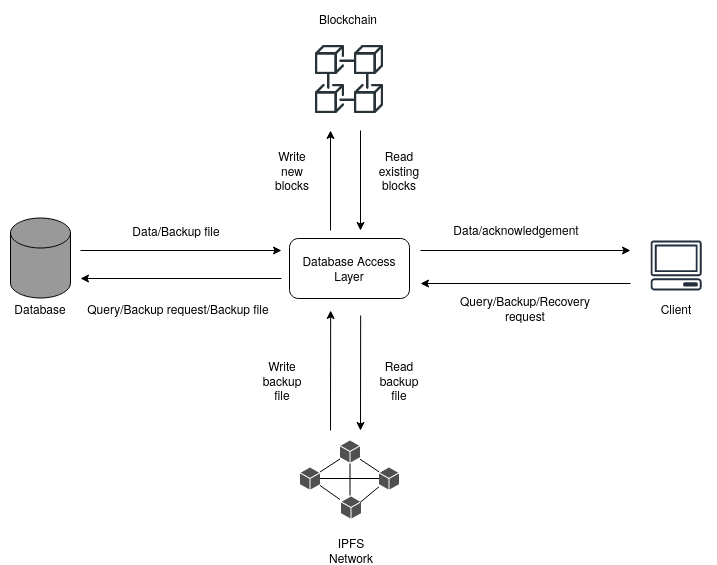

This project contains the work for the paper "Securing database backup using blockchain andpeer-to-peer network" 

## Contents

  - [Modules ](#modules-)
  - [Tools and framework ](#tools-and-framework-)
  - [Installation and running ](#installation-and-running-)
  - [Contributors and maintainers ](#contributors-and-maintainers-)


## Modules 
* core- The directory containing the main codebase
* evaluation- The files to run tests as well as the test results lies here
* webapp- A simple implementation of a one page webapp using the modified database

## Tools and framework 

Following tools and framework are used in this project:

* [IPFS](https://ipfs.io/)
* Blockchain
* [Flask](https://flask.palletsprojects.com/en/2.0.x/)
* [MYSQL](https://www.mysql.com/)


## Installation and running 

### Installing python3 and pip3
We used python version 3.8.10 for this project
```
sudo apt-get install python3.8 -y
sudo apt-get install python3-pip -y
```

### Installing python packages required for this project
```
pip3 install -r requirements.txt
```

### Installing MySQL Client
```
sudo apt-get install mysql-client -y
```

### Defining the configurations in .env
```
# Copy .env.example file as .env
# Edit .env and add configurations like: Webapp database connections, 
#     backup and restore related settings.
```

### Installing IPFS

Run the below commands to install IPFS

```
wget https://dist.ipfs.io/go-ipfs/v0.4.23/go-ipfs_v0.4.23_linux-amd64.tar.gz
tar -xvzf go-ipfs_v0.4.23_linux-amd64.tar.gz
cd go-ipfs
sudo bash install.sh
``` 

Check IPFS installation
```
ipfs --version
```

### Running instructions

Start the IPFS daemon at each node connected to the IPFS network

```
ipfs init
ipfs daemon
```

Run the webapp

```
python3 webapp.py
```

Go to the URL http://192.168.0.5:5000/register to register a new user

> The implementation is tested on Ubuntu Ubuntu 18.04 and Ubuntu 20.4


## Architecture of the database with blockchain and IPFSnetwork


## Contributors and maintainers 

This project and repository is created and maintained by:

* **Manas Gupta**

 Email: manasgupta1109@gmail.com
    
 Github: [manas11](https://github.com/manas11)
    
* **Animesh Kumar**

 Email: animuz111@gmail.com
    
 Github: [animeshk08](https://github.com/animeshk08)

 * **Aashay Maheshwarkakr**

 Email: aashaym1@gmail.com
    
 Github: [aashaym1](https://github.com/aashaym1)
