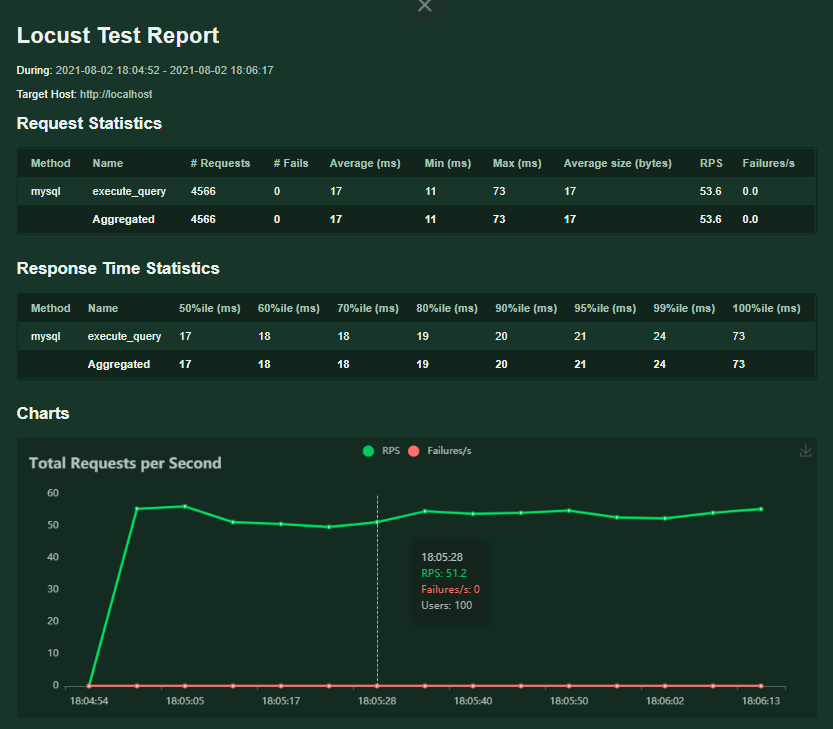

### This directory contatins scripts to test the proposed architecture.

> A single MySQL(8.0.26) relational database was used to test the performance of the added architecture.

> The experiments were performed on a 2 core Intel(R) Xeon(R) CPU E5-2620 v4 @ 2.10GHz system with 2 GB RAM.

[Locust](https://locust.io/) is an open source tool which was used to load test the architecture.

### Intalling Locust:
```
pip3 install locust
```

### The files defined are as follows:
  * [load_test.py](./load_test.py): To evaluate native MySQL database.
  * [load_test_min.py](./load_test_mine.py): To evaluate MySQL with added blockchain and peer-to-peer network.

### Running the load tests:
 - After installing locust, run locust web UI by passing the file as:
 ```
# here file passed will be the configuration to be evaluated (native or with blockchain + p2p network)
locust -f "load_test.py"
 ```
 - Specify parameters for the load test

---
 - Start the load test and below shows the example metrics observed:

---

### Evaluation results can be exported from locust to a CSV
Below are the evaluation results for 10000 requests
- [Native_stats.csv](./native_stats.csv) contains the evaluation results for native MySQL database queries.
```
# Command used:
locust -f load_test.py --headless -t 3m -u 2 --csv native
```
- [P2P-Block_stats.csv](./p2p-block_stats.csv) contains the evaluation results for MySQL with added blockchain and peer-to-peer network.
```
# Command used: 
locust -f load_test_mine.py --headless -t 3m -u 2 --csv p2p-block
```
---
### Locust can also be run in master-worker fashion too
For example:
```
# Master
locust -f load_test_mine.py --master
# Worker
locust -f load_test_mine.py --worker --master-host=127.0.0.1
```
> More details on configuring locust can be found [here](https://docs.locust.io/en/stable/configuration.html)