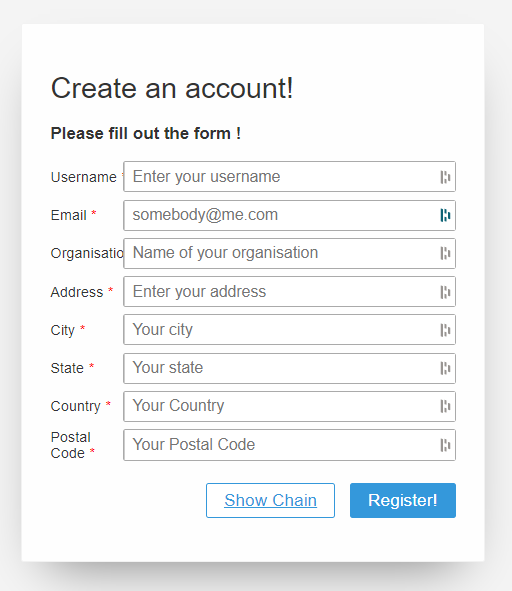
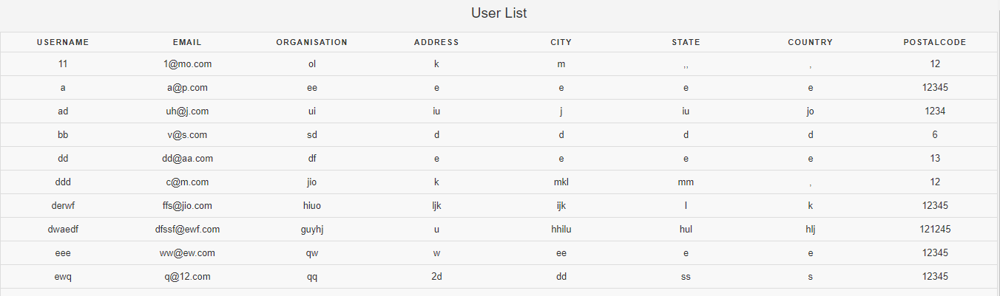

This is a simple implementation of the blockchain and peer-to-peer network based database. A single page form is available to register a new user.

### Pre-running instructions

* Create a database with a single user table.

```
mysql> create database db;
mysql> use db;
mysql> CREATE TABLE users ( username VARCHAR(10), email VARCHAR(50), organisation VARCHAR(50), address VARCHAR(50), city VARCHAR(30), state VARCHAR(30), country VARCHAR(30), postalcode INT(10), PRIMARY KEY (username) );
```

### Running instructions

```
python3 webapp.py
```
Go to the displayed URL and use below mentioned paths to perform different tasks

### Paths
---
* /register : Register a new entry \

---
* /chain : Display the current status of the blockchain
---
* /backup : Create a database backup
---
* /retrieve : Retrieve the latest database backup
---
* /users : Get all the users inside the database \

---
